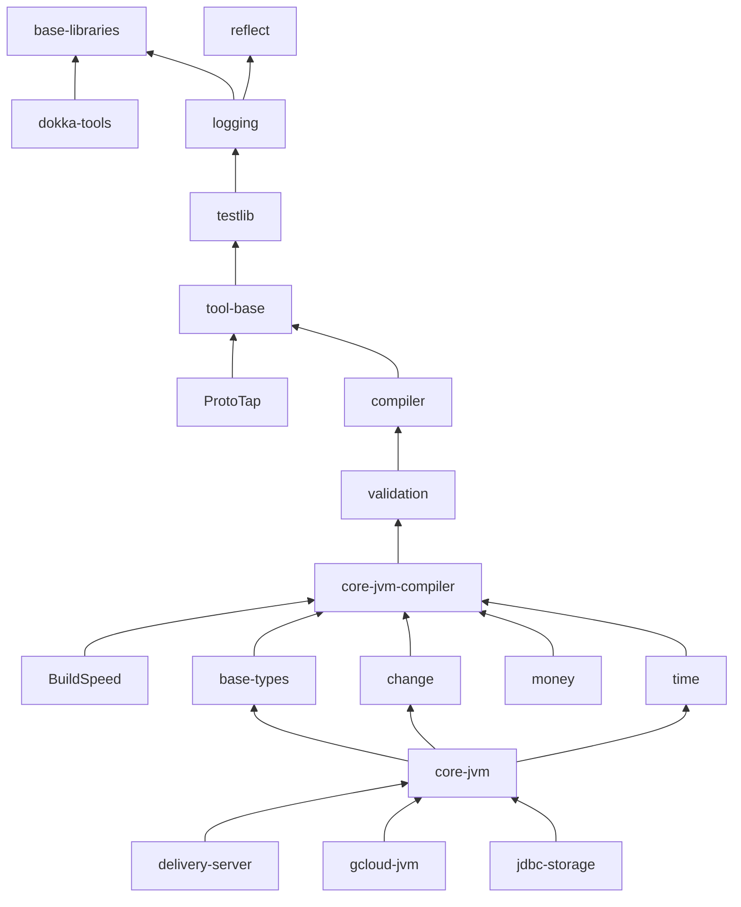
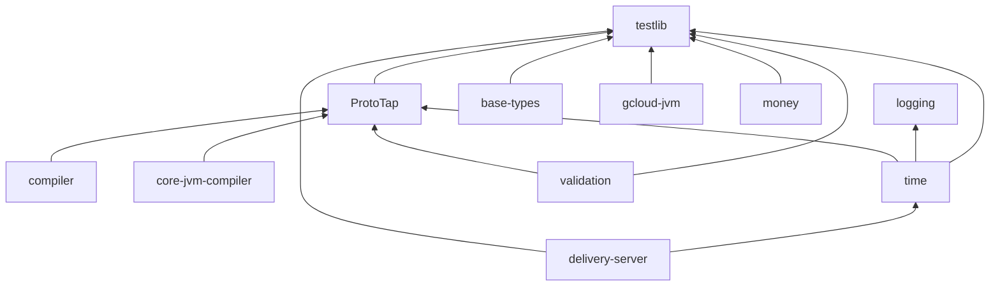
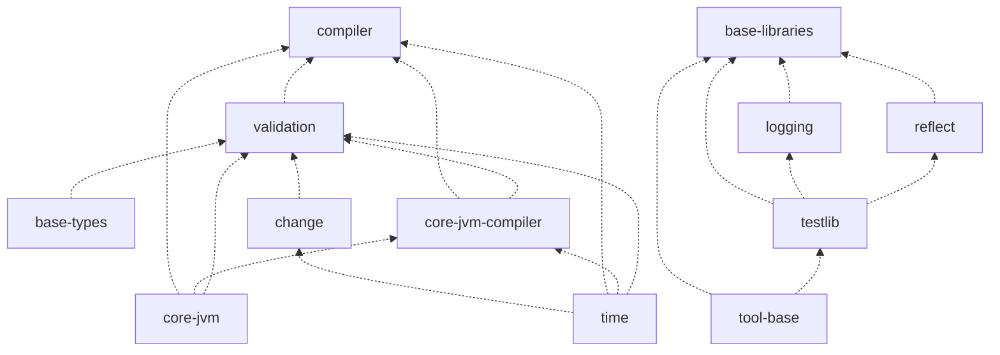

# Spine SDK dependency graph

How the Spine SDK repositories depend on each other, which of them must be
built before which, and the artifact coordinates each one publishes. In the
dependency diagrams arrows point **at the dependency**: `compiler --> tool-base`
reads "`compiler` depends on artifacts published by `tool-base`". The
mutual-pair section reverses the direction — its arrows show already-published
artifacts flowing into their consumers — and says so in place.

## Mutual dependencies and how the SDK stays buildable

The raw dependency relation is **cyclic**, because the SDK is self-hosting:
`logging` depends on `base-libraries` (its API uses `spine-base` types), while
`base-libraries` also depends on `logging` (its code writes logs); the same
holds for `ProtoTap` and the `compiler`. Taken literally, neither member of
such a pair could ever be built first.

The cycles resolve because the two directions of a mutual pair are satisfied
by **different generations of artifacts**. One direction — from the repository
*later* in the canonical order below to the one *earlier* — behaves as a
normal build-order dependency on current artifacts. The reverse direction is
satisfied by a version **already published** to the registry, built against an
older generation, so it never constrains what must be built before what. On
each successive release the two sides catch up alternately, staying about one
generation apart.

## Canonical build order

One-way dependencies constrain this order absolutely, and regeneration audits
that (a repository is never placed before one it depends on unless the pair is
genuinely mutual). Which member of a **mutual** pair counts as "earlier" is a
convention, not a derivable fact — so the order is recorded here, as reviewed
documentation.

The convention is **tools before libraries**: the code-generation tools
(`tool-base`, `ProtoTap`, `compiler`, `validation`, `core-jvm-compiler`) are
built against the previous generation of the libraries, and the libraries are
then built against the current generation of the tools. A library therefore
depends on tools of its own generation, and only the tools carry a dependency
on the generation behind them. The alternative — libraries first — is equally
consistent but puts the lag in the libraries, whose artifacts are the ones
consumed at runtime.

1. `base-libraries`
2. `reflect`
3. `logging`
4. `testlib`
5. `dokka-tools`
6. `tool-base`
7. `ProtoTap`
8. `compiler`
9. `validation`
10. `core-jvm-compiler`
11. `base-types`
12. `change`
13. `time`
14. `money`
15. `core-jvm`
16. `jdbc-storage`
17. `gcloud-jvm`
18. `delivery-server`
19. `BuildSpeed`

## Documentation tooling

`dokka-tools` publishes `io.spine.tools:dokka-extensions`, the Dokka plugin
that hides `@Internal` declarations. Every repository adds it to the
`dokkaPlugin` configuration, but none of them says so: the dependency is
declared once in `buildSrc/src/main/kotlin/DokkaExts.kt`, which `config`
distributes to all of them identically. It is therefore a property of the
shared build configuration rather than of any repository, and the edges below
— derived from repository-owned build files — do not show it.

The direction that *is* shown, `dokka-tools -> base-libraries`, is a real
declared dependency: the plugin uses `io.spine.annotation.Internal`. The
reverse direction is a documentation-time dependency on a published version,
so it constrains nothing about build order.

## Production dependencies (transitive reduction)

Declared production-scope dependencies between the repositories — the
structure of the published artifacts. For readability the diagram omits edges
implied by longer paths: `c --> b --> a` means `c` also depends on `a`
directly. Arrows point at the dependency. The complete relation (production
and test scope) is the machine-readable list at the bottom of this file.
References that merely manage versions — `force(...)`, `constraints`,
`exclude` — are not dependencies and create no edge.



<details>
<summary>Test-only dependencies (used by the repository's tests, not by its
published artifacts). `ProtoTap` is test-only by design — it taps `protoc`
output in tests — so every edge pointing at it lives here or among the mutual
pairs, never in the production diagram.</summary>



</details>

<details>
<summary>Reverse directions of the mutual dependencies — satisfied by
previously published versions, so they impose no build order. The arrow leads
from the already-published artifact to the repository consuming it.</summary>



</details>

## Repository metadata

Class `library` publishes Maven artifacts; `verify-only` builds but publishes
nothing. The marker is one published artifact whose registry metadata answers
"is version X of this repository published?"; the version property is the name
of the literal in the repository's `version.gradle.kts`.

| Repository          | Class       | Registry : marker                                  | Version property         |
|---------------------|-------------|----------------------------------------------------|--------------------------|
| `base-libraries`    | library     | gcar : `io.spine:spine-base`                       | `versionToPublish`       |
| `reflect`           | library     | gcar : `io.spine:spine-reflect`                    | `versionToPublish`       |
| `logging`           | library     | gcar : `io.spine:spine-logging`                    | `versionToPublish`       |
| `testlib`           | library     | gcar : `io.spine.tools:base-testlib`               | `versionToPublish`       |
| `dokka-tools`       | library     | gcar : `io.spine.tools:dokka-extensions`           | `versionToPublish`       |
| `tool-base`         | library     | gcar : `io.spine.tools:jvm-tools`                  | `versionToPublish`       |
| `ProtoTap`          | library     | gcar : `io.spine.tools:prototap-gradle-plugin`     | `versionToPublish`       |
| `compiler`          | library     | gcar : `io.spine.tools:compiler-jvm`               | `compilerVersion`        |
| `validation`        | library     | gcar : `io.spine.tools:validation-java`            | `validationVersion`      |
| `core-jvm-compiler` | library     | gcar : `io.spine.tools:core-jvm-gradle-plugin`     | `coreJvmCompilerVersion` |
| `base-types`        | library     | gcar : `io.spine:spine-base-types`                 | `versionToPublish`       |
| `change`            | library     | gcar : `io.spine:spine-change`                     | `versionToPublish`       |
| `time`              | library     | gcar : `io.spine:spine-time`                       | `versionToPublish`       |
| `money`             | library     | gcar : `io.spine:spine-money`                      | `versionToPublish`       |
| `core-jvm`          | library     | gcar : `io.spine:spine-core`                       | `versionToPublish`       |
| `jdbc-storage`      | library     | gcar : `io.spine:spine-rdbms`                      | `versionToPublish`       |
| `gcloud-jvm`        | library     | gcar : `io.spine.gcloud:spine-datastore`           | `versionToPublish`       |
| `delivery-server`   | library     | github : `io.spine.delivery:spine-delivery-server` | `versionToPublish`       |
| `BuildSpeed`        | verify-only | —                                                  | —                        |

`documentation` is not on the graph: it is a Spine 1.x site project, not part
of the SDK build line.

## Maintenance

The relation is derived from `import io.spine.dependency.local.*` usages in
each repository's own build files (never the config-distributed `buildSrc/`,
whose files exist in every repository regardless of use), plus the manual
edges kept in `extra_edges()` in [`../cascade`](../cascade) for dependencies
wired through convention scripts. Regenerate after a topology change with:

```bash
./cascade graph
```

Cross-repository automation ([`rollout/rebuild.md`](rollout/rebuild.md))
consumes this file as its ordering contract and verifies it against a fresh
derivation before acting, so changes — including changes to the canonical
order — must land here, reviewed, first.

## Complete dependency list (machine-readable)

Every direct **declared** dependency (production and test scope), one
`dependent dependency` pair per line — the left repository depends on
artifacts published by the right one. Both directions of the mutual pairs are
included; version-management references are excluded; the diagrams above are
renderings of this list.

```edges
BuildSpeed core-jvm-compiler
ProtoTap base-libraries
ProtoTap logging
ProtoTap testlib
ProtoTap tool-base
base-libraries logging
base-libraries reflect
base-libraries testlib
base-libraries tool-base
base-types base-libraries
base-types compiler
base-types core-jvm-compiler
base-types testlib
base-types validation
change base-libraries
change compiler
change core-jvm-compiler
change time
change validation
compiler ProtoTap
compiler base-libraries
compiler core-jvm
compiler core-jvm-compiler
compiler logging
compiler reflect
compiler testlib
compiler time
compiler tool-base
compiler validation
core-jvm base-libraries
core-jvm base-types
core-jvm change
core-jvm core-jvm-compiler
core-jvm logging
core-jvm reflect
core-jvm testlib
core-jvm time
core-jvm validation
core-jvm-compiler ProtoTap
core-jvm-compiler base-libraries
core-jvm-compiler compiler
core-jvm-compiler core-jvm
core-jvm-compiler logging
core-jvm-compiler reflect
core-jvm-compiler testlib
core-jvm-compiler time
core-jvm-compiler tool-base
core-jvm-compiler validation
delivery-server compiler
delivery-server core-jvm
delivery-server core-jvm-compiler
delivery-server logging
delivery-server testlib
delivery-server time
delivery-server validation
dokka-tools base-libraries
gcloud-jvm base-libraries
gcloud-jvm base-types
gcloud-jvm compiler
gcloud-jvm core-jvm
gcloud-jvm core-jvm-compiler
gcloud-jvm logging
gcloud-jvm testlib
gcloud-jvm validation
jdbc-storage core-jvm
jdbc-storage core-jvm-compiler
jdbc-storage validation
logging base-libraries
logging reflect
logging testlib
money base-libraries
money compiler
money core-jvm-compiler
money testlib
money validation
reflect testlib
testlib logging
testlib tool-base
time ProtoTap
time base-libraries
time compiler
time core-jvm-compiler
time logging
time testlib
time tool-base
time validation
tool-base base-libraries
tool-base logging
tool-base testlib
validation ProtoTap
validation base-libraries
validation base-types
validation change
validation compiler
validation core-jvm
validation core-jvm-compiler
validation logging
validation reflect
validation testlib
validation time
validation tool-base
```
